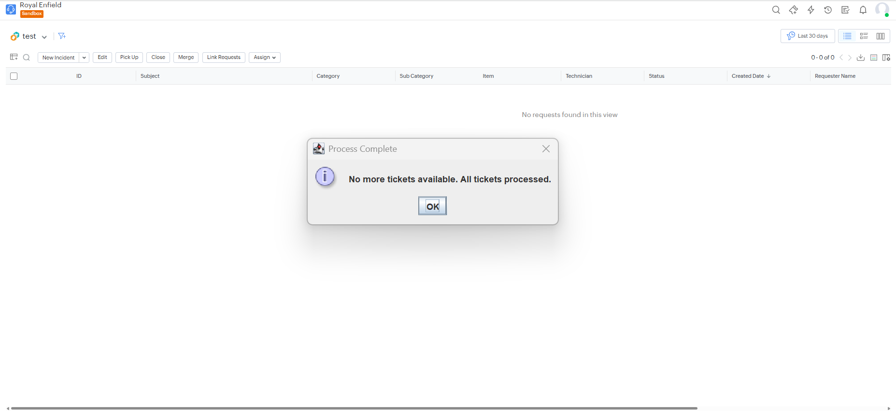

# My Java Project

This is a basic Java project set up with Maven.

## Prerequisites

- Java 17 or higher
- Maven

## How to Run

1. Compile the project: `mvn compile`
2. Run the main class: `mvn exec:java -Dexec.mainClass="com.example.Main"`

## Structure

- `src/main/java`: Source code
- `src/test/java`: Test code
- `pom.xml`: Maven configuration

